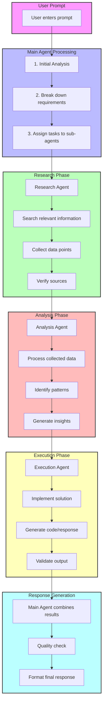

```mermaid
flowchart TD
    subgraph UserInput["User Prompt"]
        UP[User enters prompt]
    end

    subgraph MainAgent["Main Agent Processing"]
        MA1[1. Initial Analysis]
        MA2[2. Break down requirements]
        MA3[3. Assign tasks to sub-agents]
    end

    subgraph ResearchPhase["Research Phase"]
        R1[Research Agent]
        R2[Search relevant information]
        R3[Collect data points]
        R4[Verify sources]
    end

    subgraph AnalysisPhase["Analysis Phase"]
        A1[Analysis Agent]
        A2[Process collected data]
        A3[Identify patterns]
        A4[Generate insights]
    end

    subgraph ExecutionPhase["Execution Phase"]
        E1[Execution Agent]
        E2[Implement solution]
        E3[Generate code/response]
        E4[Validate output]
    end

    subgraph ResponseGeneration["Response Generation"]
        RG1[Main Agent combines results]
        RG2[Quality check]
        RG3[Format final response]
    end

    %% Flow connections
    UP --> MA1
    MA1 --> MA2 --> MA3
    MA3 --> R1
    R1 --> R2 --> R3 --> R4
    R4 --> A1
    A1 --> A2 --> A3 --> A4
    A4 --> E1
    E1 --> E2 --> E3 --> E4
    E4 --> RG1
    RG1 --> RG2 --> RG3

    %% Styling
    style UserInput fill:#f9f,stroke:#333,stroke-width:2px
    style MainAgent fill:#bbf,stroke:#333,stroke-width:2px
    style ResearchPhase fill:#bfb,stroke:#333,stroke-width:2px
    style AnalysisPhase fill:#fbb,stroke:#333,stroke-width:2px
    style ExecutionPhase fill:#ffb,stroke:#333,stroke-width:2px
    style ResponseGeneration fill:#bff,stroke:#333,stroke-width:2px
``` 