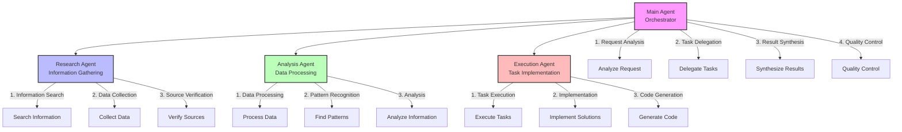

This diagram shows:

1. Main Agent (Orchestrator):
   - Analyzes incoming requests
   - Delegates tasks to appropriate sub-agents
   - Synthesizes results from sub-agents
   - Ensures quality control

2. Research Agent:
   - Searches for relevant information
   - Collects necessary data
   - Verifies sources and credibility

3. Analysis Agent:
   - Processes collected data
   - Identifies patterns and relationships
   - Performs in-depth analysis

4. Execution Agent:
   - Executes specific tasks
   - Implements solutions
   - Generates code when needed

The color coding helps distinguish between different agent types and their specific roles in the system. 