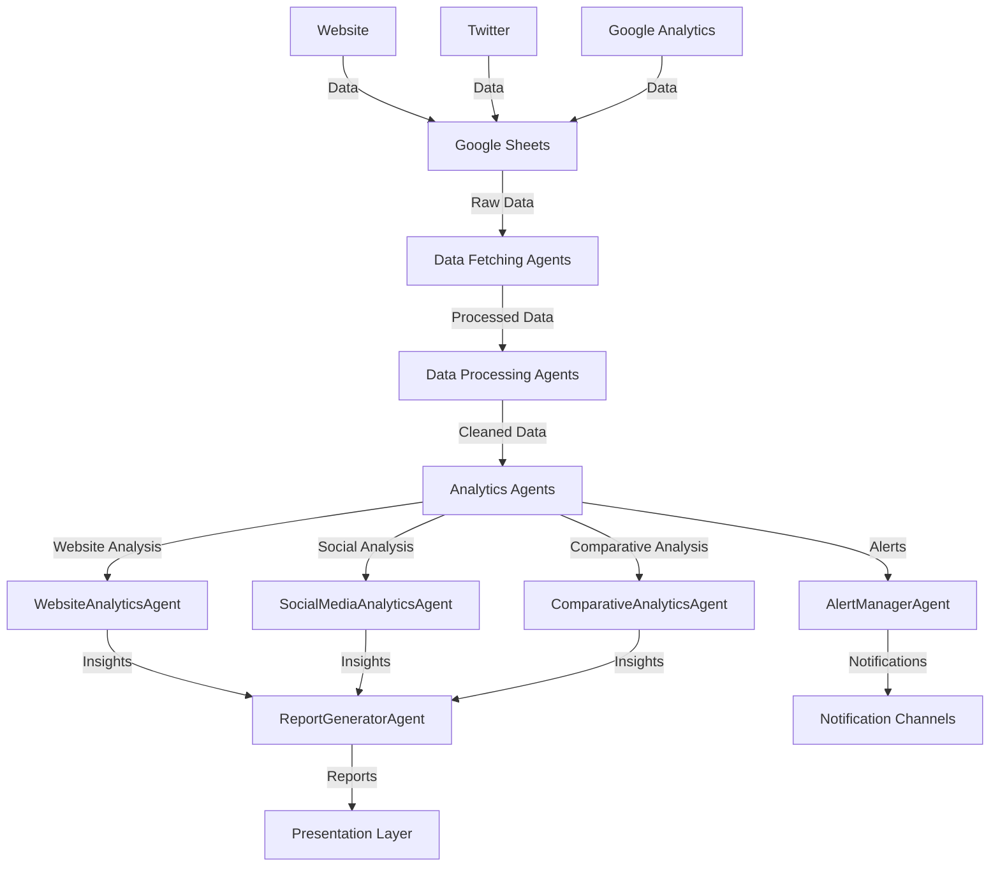
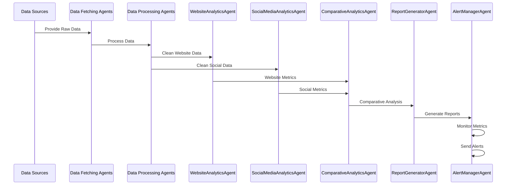

# Analytics & Reporting System Architecture

## System Overview

The following Mermaid diagrams illustrate the architecture and data flow of our analytics and reporting system.

## Data Flow Architecture

## Agent Interaction Flow

## Component Details

### Data Sources
- Website: Raw website metrics and user behavior data
- Twitter: Social media engagement and content performance data
- Google Analytics: Comprehensive web analytics data

### Data Processing Layer
- Data Fetching Agents: Retrieve data from various sources
- Data Processing Agents: Clean, validate, and transform data

### Analytics Layer
- WebsiteAnalyticsAgent: Analyze website performance and user behavior
- SocialMediaAnalyticsAgent: Analyze social media engagement and content
- ComparativeAnalyticsAgent: Compare performance across channels

### Presentation & Alerting Layer
- ReportGeneratorAgent: Generate comprehensive reports
- AlertManagerAgent: Monitor metrics and send notifications
- Notification Channels: Email, Telegram, etc.

## Data Flow Description

1. **Data Collection**
   - Data is collected from website, Twitter, and Google Analytics
   - Stored in Google Sheets for centralized access

2. **Data Processing**
   - Data Fetching Agents retrieve data from Google Sheets
   - Data Processing Agents clean and transform the data
   - Data is validated and standardized

3. **Analysis**
   - WebsiteAnalyticsAgent analyzes website metrics
   - SocialMediaAnalyticsAgent analyzes social media metrics
   - ComparativeAnalyticsAgent performs cross-channel analysis

4. **Reporting & Alerting**
   - ReportGeneratorAgent creates comprehensive reports
   - AlertManagerAgent monitors metrics and sends alerts
   - Reports and alerts are delivered through appropriate channels

## System Integration

The system is designed to be modular and extensible:
- Each agent operates independently but can communicate with others
- New data sources can be easily integrated
- New analysis methods can be added without affecting other components
- Reporting and alerting can be customized based on requirements 