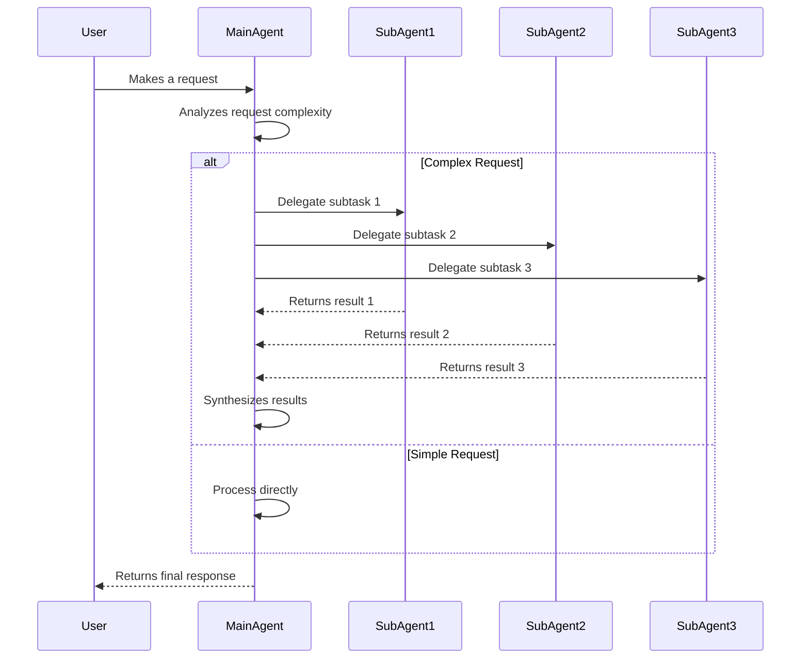

This diagram shows:
1. User initiates a request
2. MainAgent evaluates if the request needs multiple agents
3. If complex:
   - MainAgent splits tasks among specialized SubAgents
   - Each SubAgent processes its assigned task
   - MainAgent combines the results
4. If simple:
   - MainAgent handles the request directly
5. Final response is returned to the user 